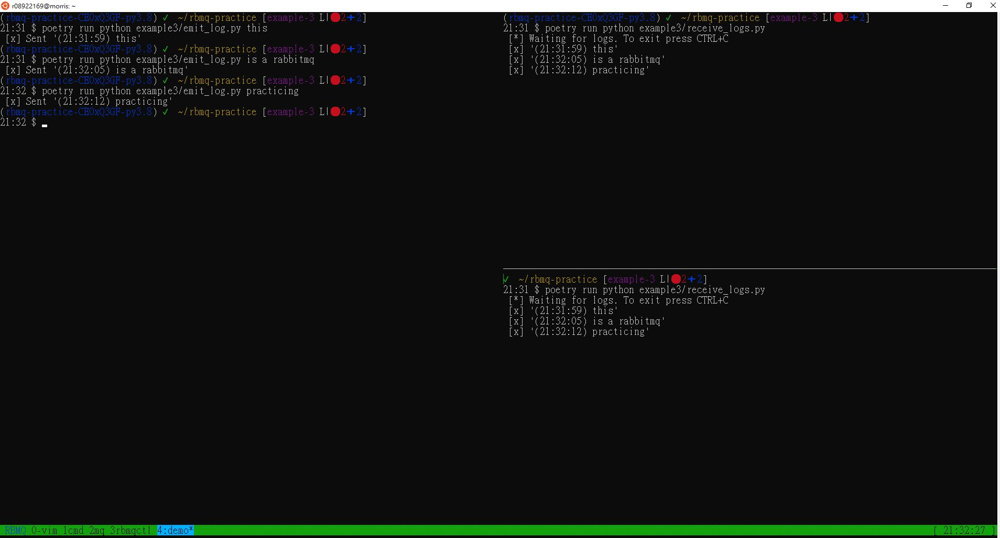
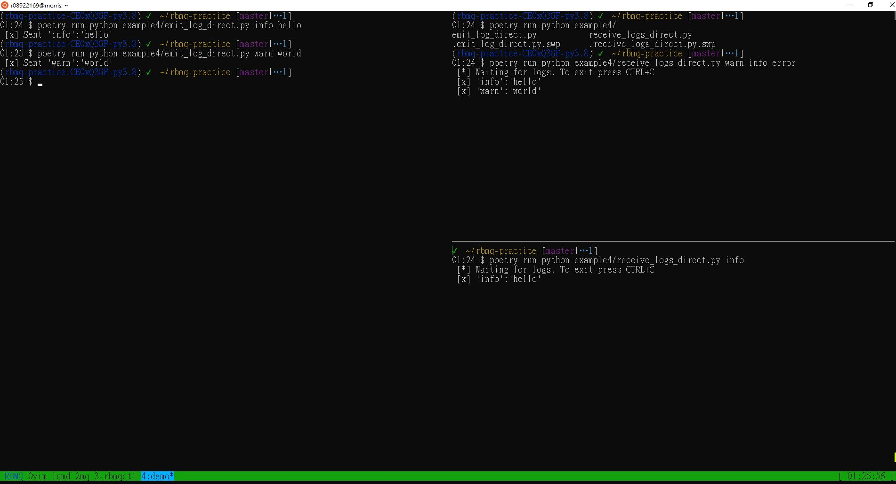

# RBMQ Practice

## Example 1
### round robin for passing messages to receivers

## Example 2
### tasks survive failure of worker

### dispatching tasks fairly

## Example 3
### broadcast messages

## Example 4
### using direct to bind queues

## TODO
- [ ] add timezone into docker

## Docker

### Using `rabbitmqctl` in the Container

> $ docker exec rabbitmq su rabbitmq -- /opt/rabbitmq/sbin/rabbitmqctl \<command\>

#### show status
> $ docker exec rabbitmq su rabbitmq -- /opt/rabbitmq/sbin/rabbitmqctl status

#### list exchanges
> $ docker exec rabbitmq su rabbitmq -- /opt/rabbitmq/sbin/rabbitmqctl list\_exchanges

#### list queues
> $ docker exec rabbitmq su rabbitmq -- /opt/rabbitmq/sbin/rabbitmqctl list\_queues

#### list detail of queues
> $ docker exec rabbitmq su rabbitmq -- /opt/rabbitmq/sbin/rabbitmqctl list\_queues name messages\_ready messages\_unacknowledged

#### list bindings
> $ docker exec rabbitmq su rabbitmq -- /opt/rabbitmq/sbin/rabbitmqctl list\_bindings

## [Source of Examples](https://www.rabbitmq.com/)
