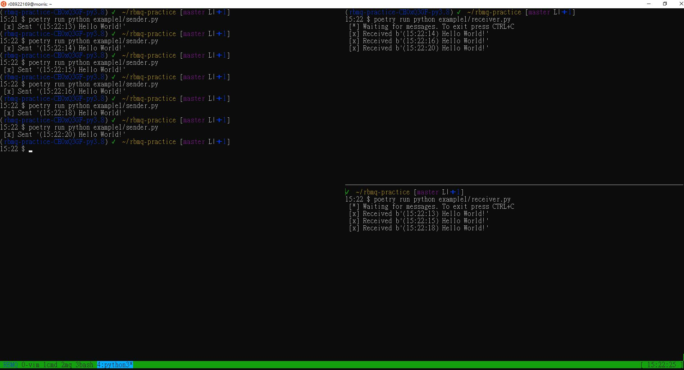
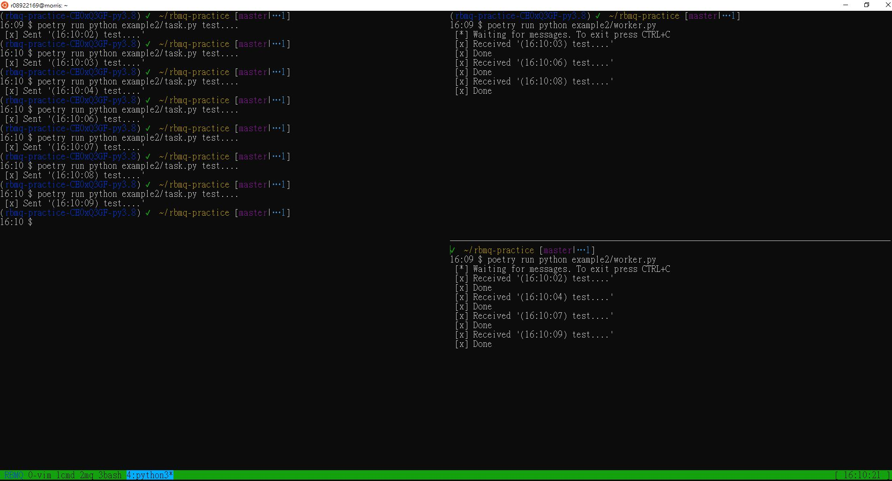
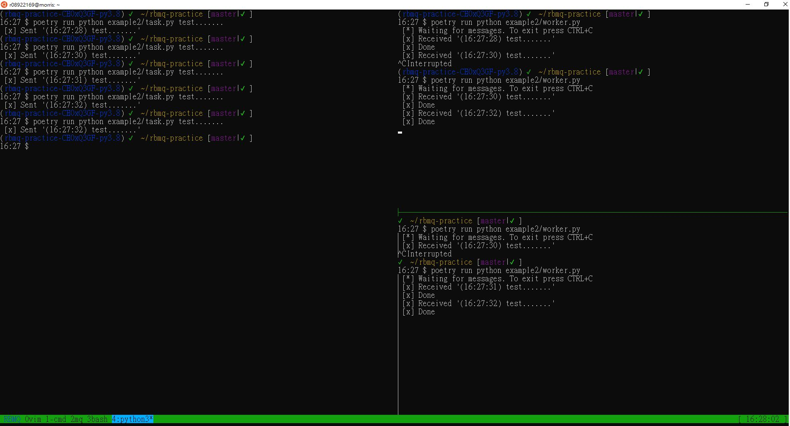

# RBMQ Practice

## example1
### round robin for passing messages to receivers

## example2
### tasks survive failure of worker

### dispatching tasks fairly

## TODO
- [ ] add timezone into docker

## [Source of Examples](https://www.rabbitmq.com/)
